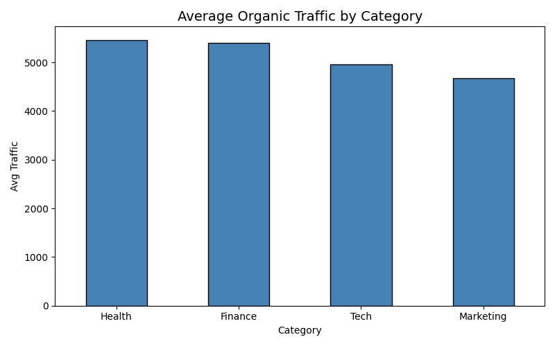
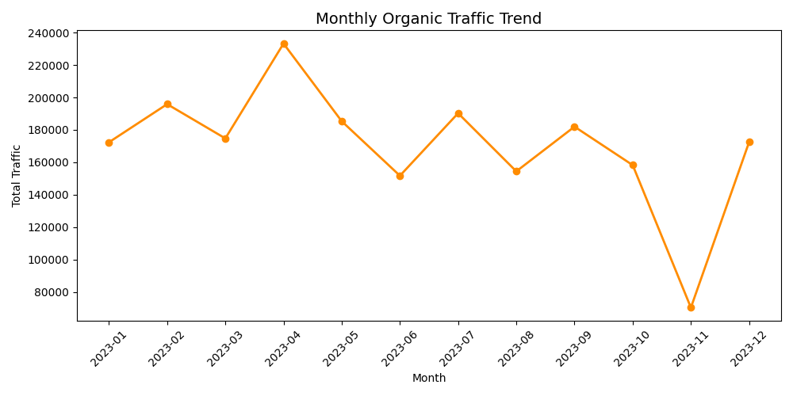
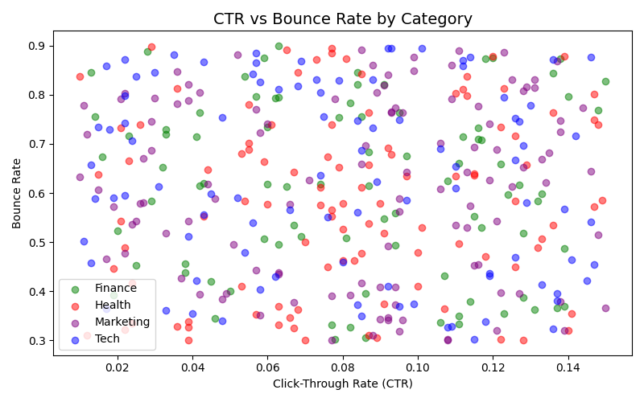

## SEO Content Performance Dashboard

Analysed 400+ articles to surface traffic trends, CTR patterns, 
and content performance by category using Python.

**Tools:** Python, Pandas, NumPy, Matplotlib  
**Dataset:** Synthetically generated (400 articles, 12 months)

### Key Insights
- Identified top-performing content categories by average organic traffic
- Visualised monthly traffic trends across 2023
- Mapped CTR vs Bounce Rate relationship by category

### Charts

